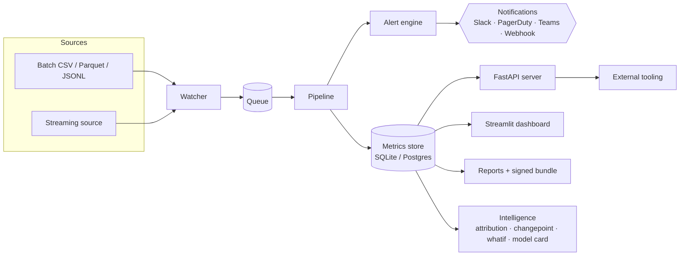

<h1 align="center">BioModel Monitor</h1>

<p align="center">
  <strong>Post-deployment monitoring & assurance for multimodal medical AI.</strong><br/>
  Drift, calibration, fairness, plausibility, silent-failure, and regulatory bundles —
  with a service, an HTTP API, and an intelligence layer that <em>explains</em> the alerts.
</p>

<p align="center">
  <a href="https://github.com/zdevfromcairo/biomodel/actions/workflows/ci.yml"></a>
  <a href="https://github.com/zdevfromcairo/biomodel/actions/workflows/docs.yml"></a>
  <a href="https://zdevfromcairo.github.io/biomodel/"></a>
  
  
  
  
</p>

<p align="center">
  <a href="https://zdevfromcairo.github.io/biomodel/quickstart/">Quickstart</a> ·
  <a href="https://zdevfromcairo.github.io/biomodel/architecture/">Architecture</a> ·
  <a href="https://zdevfromcairo.github.io/biomodel/server/">Server</a> ·
  <a href="https://zdevfromcairo.github.io/biomodel/intelligence/">Intelligence</a> ·
  <a href="https://zdevfromcairo.github.io/biomodel/streaming/">Streaming</a> ·
  <a href="https://zdevfromcairo.github.io/biomodel/reactive/">Reactive&nbsp;(v0.8)</a> ·
  <a href="https://zdevfromcairo.github.io/biomodel/platform/">Platform&nbsp;(v0.9)</a> ·
  <a href="https://zdevfromcairo.github.io/biomodel/closed_loop/">Closed&nbsp;loop&nbsp;(v0.10)</a> ·
  <a href="https://zdevfromcairo.github.io/biomodel/observability/">Observability&nbsp;(v0.11)</a> ·
  <a href="https://zdevfromcairo.github.io/biomodel/tenancy/">Tenancy</a> ·
  <a href="https://zdevfromcairo.github.io/biomodel/adr/">ADRs</a> ·
  <a href="https://zdevfromcairo.github.io/biomodel/metric_library/">Metrics</a>
</p>

---

## Why

Generic ML monitoring tracks uptime and aggregate accuracy. **Medical AI fails differently.**
Models can appear stable on a dashboard while becoming biologically implausible, clinically
miscalibrated, or distributionally brittle across sites, scanners, protocols, and populations.

BioModel Monitor is a specialized monitoring layer that speaks the language of biomedical
model risk and answers the only question a model owner cares about:

> *Is my model still behaving acceptably, and if not, exactly **where** is it breaking,
> **why**, and **what** would fix it?*

## Highlights

- **Domain-aware metrics** — drift, calibration (binary + multiclass), fairness, subgroup
  with Wilson CIs, plausibility rule packs (pathology, radiology, omics), silent-failure
  signatures, bootstrap CIs.
- **Service, not a script** *(v0.4)* — FastAPI HTTP server, OpenAPI, API-key auth,
  structured JSON logs, Prometheus `/metrics`, signed webhooks, **Slack / PagerDuty /
  Microsoft Teams**, **SQLite or Postgres**, Docker Compose.
- **Explains itself** *(v0.5)* — per-alert root-cause attribution, changepoint detection,
  counterfactual *what-if* drift, robust-z anomaly score, active-learning incident queue,
  auto-generated model cards.
- **Streams + forecasts + has an SDK** *(v0.6)* — server-side micro-batching `/ingest`
  endpoint, Holt's-linear **drift forecasting with ETA-to-breach**, split-conformal
  prediction intervals, PCA concept-drift detector, interaction-effect attribution,
  zero-dependency **Python SDK**.
- **Multi-tenant + plug-in + federation-ready** *(v0.7)* — RBAC tenants
  (`viewer`/`operator`/`writer`/`admin`), entry-point plug-ins for metrics /
  notifiers / loaders, **federated drift & calibration** from per-site sufficient
  statistics (no raw records leave the site), tamper-evident SHA-256-chained audit
  log, predictive-uncertainty (entropy + BALD), official **Helm chart**.
- **Reactive core** *(v0.8)* — concurrent **`pipeline-async`** (4× workers,
  byte-identical results), **WebSocket `/ws/events`** live event bus with replay,
  **embedding-drift via MMD** with permutation p-value, **online CUSUM** change
  detector, per-record **local attribution** (leave-one-out), **drift influence
  graph** between dimensions, OpenAPI-as-YAML at `/openapi.yaml`.
- **Platform & governance** *(v0.9)* — **model registry** with versions,
  training-data hash, lineage edges and **quarantine** (audit-trailed,
  event-streamed); **declarative YAML policy engine** that turns alerts into
  typed actions (notify / quarantine / promote); **differential-privacy**
  Laplace mechanism + ε-budget accountant for federated stats; **sliced
  1-D Wasserstein** drift; **mSPRT canary** monitor with Type-I control at
  arbitrary stopping times; **CycloneDX-1.5 SBOM** + **SLSA-v1.0** provenance;
  five MADR-lite **Architecture Decision Records**.
- **Closed loop** *(v0.10)* — **active-learning queue** (entropy / margin /
  least-confidence / **BALD**) persisted in SQLite so reviewers resume across
  restarts; **split-conformal prediction** (APS + LAC) with marginal coverage
  guarantee `≥ 1 − α`; **expert-label feedback** that re-runs calibration on
  the human-validated subset; **shadow-deployment comparator** with paired
  **McNemar** + paired **bootstrap** so a canary can be judged on the
  *same* records production saw, with full statistical power.
- **Observability mesh & multi-modal** *(v0.11)* — opt-in **OpenTelemetry**
  tracer + meter (no-op when the API package is missing, so existing
  deployments are unchanged); **per-modality validators** for image
  (resolution / intensity / channels), text (token-length / vocab Jaccard)
  and tabular (per-column missingness deltas); **vector embedding store**
  with brute-force cosine k-NN that answers *"which historical case is
  this most like?"*; **model fingerprinting** — a SHA-256 over predictions
  on a fixed canary set, deterministic to floating-point noise, that
  detects silent weight substitution.
- **Audit-ready** — signed regulatory export bundles (SHA-256 manifest), persistent
  annotations, persistence-aware severity, per-cohort fairness summary.

## Feature matrix

| Capability | v0.1 | v0.2 | v0.3 | v0.4 | v0.5 | v0.6 | v0.7 | v0.8 | v0.9 | v0.10 | v0.11 |
| ---------- | :--: | :--: | :--: | :--: | :--: | :--: | :--: | :--: | :--: | :---: | :---: |
| Drift / calibration / subgroup | ✓ | ✓ | ✓ | ✓ | ✓ | ✓ | ✓ | ✓ | ✓ | ✓ | ✓ |
| Plausibility rule packs (path / rad / omics) | ✓ | ✓ | ✓ | ✓ | ✓ | ✓ | ✓ | ✓ | ✓ | ✓ | ✓ |
| Persistent store + incidents |  | ✓ | ✓ | ✓ | ✓ | ✓ | ✓ | ✓ | ✓ | ✓ | ✓ |
| FastAPI server, Slack/PD/Teams |  |  |  | ✓ | ✓ | ✓ | ✓ | ✓ | ✓ | ✓ | ✓ |
| Root-cause attribution + model card |  |  |  |  | ✓ | ✓ | ✓ | ✓ | ✓ | ✓ | ✓ |
| Streaming `/ingest` + forecasting + SDK |  |  |  |  |  | ✓ | ✓ | ✓ | ✓ | ✓ | ✓ |
| RBAC tenants + audit log + plugins + federation |  |  |  |  |  |  | ✓ | ✓ | ✓ | ✓ | ✓ |
| Helm chart |  |  |  |  |  |  | ✓ | ✓ | ✓ | ✓ | ✓ |
| Concurrent pipeline + WebSocket events + MMD + CUSUM |  |  |  |  |  |  |  | ✓ | ✓ | ✓ | ✓ |
| Registry & quarantine + policy engine + DP federation + Wasserstein + mSPRT canary + SBOM |  |  |  |  |  |  |  |  | ✓ | ✓ | ✓ |
| **Closed loop** — active-learning queue + conformal prediction + expert-label feedback + shadow-deployment comparator |  |  |  |  |  |  |  |  |  | ✓ | ✓ |
| **Observability mesh** — OpenTelemetry tracer/meter + per-modality (image/text/tabular) validators + vector k-NN explanations + model fingerprinting |  |  |  |  |  |  |  |  |  |  | ✓ |

## Architecture



## Quickstart

```bash
# Install (with all optional extras)
pip install -e ".[dev,parquet,dashboard,server]"

# Run the bundled pathology example end-to-end
python -m examples.pathology_pipeline.run_example

# Or via the CLI with a YAML config
biomodel-monitor run --config examples/pathology_pipeline/config.yaml
```

The run produces an HTML + Markdown report under `reports_out/` plus a JSON metrics bundle.

### As a service (v0.4)

```bash
biomodel-monitor serve --store ./biomodel.db --api-key dev-key --port 8080

# OpenAPI:    http://localhost:8080/docs
# Health:     http://localhost:8080/health
# Prometheus: http://localhost:8080/metrics
```

### Explain an alert (v0.5)

```bash
# When did PSI start drifting? (changepoints + robust-z anomaly score)
biomodel-monitor explain     --store mon.db --model-id m1 --model-version 1.0.0 --metric psi

# What if we exclude ScannerY?
biomodel-monitor whatif      --input new.csv --baseline baseline.json --exclude scanner_id=ScannerY

# Auto-generated model card from the persistent store
biomodel-monitor model-card  --store mon.db --model-id m1 --model-version 1.0.0 --out card.md
```

### The full stack with Docker Compose

```bash
docker compose up --build
```

| Service     | Port | Purpose                                       |
| ----------- | ---- | --------------------------------------------- |
| `server`    | 8080 | FastAPI HTTP API                              |
| `watcher`   |  —   | Watches `./incoming/` for new batches         |
| `dashboard` | 8501 | Streamlit triage dashboard                    |

All three share the same SQLite store on a named volume; switch to Postgres
by setting `BIOMODEL_STORE_DSN` on the `server` service.

## What's new

- **v0.11.0 — Observability mesh & multi-modal.** Opt-in **OpenTelemetry**
  tracer + meter (no-op fallback so existing deployments are unaffected);
  per-modality validators for **image / text / tabular** that consume
  lightweight summary stats; SQLite-backed **vector store** with
  brute-force cosine k-NN for *"most similar historical case"*
  explanations; deterministic **model fingerprinting** via SHA-256 over
  predictions on a fixed canary input set, robust to harmless
  floating-point noise.
- **v0.10.0 — Closed loop.** Persistent **active-learning queue** with
  uncertainty strategies (entropy / margin / least-confidence / **BALD**);
  **split-conformal prediction** (APS + LAC) with marginal coverage
  guarantees; **expert-label feedback** that re-runs calibration on the
  human-validated subset; **shadow-deployment comparator** with paired
  McNemar + paired bootstrap.
- **v0.9.0 — Platform & Governance.** Model **registry** with quarantine,
  lineage edges, and a hash-chained audit trail; **declarative YAML
  policies** that turn alerts into typed actions; **differential-privacy**
  Laplace noise + ε-budget accountant for federated stats;
  **sliced-Wasserstein** drift; **mSPRT canary** monitor; **CycloneDX SBOM**
  + SLSA-v1.0 provenance; first five **Architecture Decision Records**.
- **v0.8.0 — Reactive core.** Concurrent `pipeline-async` (4× workers,
  byte-identical results), WebSocket `/ws/events` live event bus with
  replay, embedding-drift via **MMD** with permutation p-value, online
  **CUSUM** change detector, per-record **local attribution**, dimension
  **drift influence graph**, OpenAPI-as-YAML at `/openapi.yaml`, MkDocs
  custom hero + SVG logo.
- **v0.7.0 — Multi-tenant, Plugins & Federation.** RBAC tenants, entry-point
  plug-in system, federated drift/calibration aggregation from sufficient
  statistics, SHA-256 chained audit log, predictive uncertainty, Helm chart,
  governance & contributing.
- **v0.6.0 — Streaming, Forecasting & SDK.** Server-side micro-batching `/ingest`,
  Holt's-linear drift forecasting with ETA-to-breach, split-conformal intervals,
  PCA concept-drift detector, interaction-effect attribution, zero-dependency Python SDK.
- **v0.5.0 — Intelligence & Explanation.** Root-cause attribution, changepoint detection,
  counterfactual *what-if* drift, anomaly score, active-learning queue, auto model cards.
- **v0.4.0 — Server & Stack.** FastAPI server, Storage Protocol with SQLite + Postgres,
  Prometheus metrics, signed webhooks, Slack / PagerDuty / Teams, Docker Compose.
- **v0.3.0 — Beyond pathology.** Multiclass calibration, fairness, bootstrap CIs,
  radiology + omics rule packs, cross-model dependency graph, signed regulatory bundle.
- **v0.2.0 — Operational.** Persistent SQLite store, persistence-aware severity, incident
  workspace, threshold auto-tuning, rolling baselines with promotion, near-real-time
  ingestion, pluggable notifications.
- **v0.1.0 — Offline batch monitor.** Drift, calibration, subgroup, plausibility,
  silent failure, alerts, HTML/MD reports, Streamlit dashboard.

Full history: [CHANGELOG.md](CHANGELOG.md).

## Layout

```
biomodel_monitor/
  schema/         Pydantic models for predictions, batch metadata, cohort
  ingest/         CSV / Parquet / JSONL loaders + contract validation
  metrics/        drift, calibration (binary + multiclass), subgroup,
                  plausibility (pathology + radiology + omics), silent_failure,
                  fairness, bootstrap CIs
  baselines/      reference-window storage + rolling learner with promotion
  alerts/         threshold engine, severity, dedup, threshold auto-tuning
  store/          Storage Protocol; SQLite + Postgres adapters         (v0.4)
  incidents/      incident workspace (ack / resolve / comment / label)
  scheduler/      directory watcher + filesystem queue
  notifications/  webhook (signed), Slack, PagerDuty, Teams, file       (v0.4)
  intelligence/   attribution, changepoint, whatif, anomaly,
                  active learning, model card,                           (v0.5)
                  causal interaction-effect attribution                  (v0.6)
  metrics/        + forecast (Holt's), conformal, concept_drift          (v0.6)
                  + uncertainty (entropy + BALD)                         (v0.7)
  streaming/      WindowBuffer micro-batching for /ingest                (v0.6)
  client/         Python SDK (stdlib-only)                               (v0.6)
  tenancy/        TenantContext + role-based access control              (v0.7)
  plugins/        entry-point discovery for metrics/notifiers/loaders    (v0.7)
  federated/      pooled drift/calibration from sufficient statistics    (v0.7)
  audit/          tamper-evident, hash-chained audit log                 (v0.7)
  registry/       model registry: versions, status, lineage, quarantine  (v0.9)
  policy/         declarative YAML governance policy engine              (v0.9)
  canary/         mSPRT A/B canary monitor                               (v0.9)
  security/       CycloneDX SBOM + SLSA provenance                       (v0.9)
  active_learning/ uncertainty-driven labelling priority queue           (v0.10)
  conformal/      split-conformal prediction sets (APS + LAC)            (v0.10)
  feedback/       expert-label merge → recompute calibration             (v0.10)
  shadow/         paired McNemar + paired bootstrap comparators          (v0.10)
  observability/  optional OpenTelemetry tracer + meter                  (v0.11)
  modality/       per-modality validators (image / text / tabular)       (v0.11)
  vector/         embedding store + brute-force k-NN explanations        (v0.11)
  fingerprint/    model fingerprint via canary-input prediction hash     (v0.11)
  intelligence/   + local_attribution, drift_graph                       (v0.8)
  dependency/     cross-model dependency graph + alert attribution
  reports/        Jinja2 HTML + Markdown templates + regulatory bundle
  server/         FastAPI app, API-key auth, /metrics, structured logs,  (v0.4)
                  /ingest streaming, /forecast,                          (v0.6)
                  /tenants/whoami, /audit/*, /federate/*, /plugins       (v0.7)
                  /mmd, /cusum, /events, /ws/events, /openapi.yaml       (v0.8)
                  /models, /lineage, /policy/evaluate,                   (v0.9)
                  /wasserstein, /sbom                                    (v0.9)
                  /active-learning/*, /conformal/*, /shadow/*           (v0.10)
                  /modality/check, /vector/*, /fingerprint, /fingerprint/compare (v0.11)
  dashboard/      Streamlit dashboard
  cli.py          biomodel-monitor run|watch|process-queue|incidents|
                  serve|explain|whatif|model-card|forecast|ingest|       (v0.6)
                  client-call|tenant|plugins|federate|audit-verify       (v0.7)
                  pipeline-async|mmd|cusum|drift-graph|events-tail       (v0.8)
                  registry|policy-eval|wasserstein|sbom|canary           (v0.9)
                  active-learning|conformal|shadow                      (v0.10)
                  otel-status|modality-check|vector|fingerprint         (v0.11)
deploy/
  helm/biomodel-monitor/    official Helm chart                          (v0.7)
examples/
  pathology_pipeline/   runnable synthetic pathology integration
docs/              MkDocs Material site (deployed to GitHub Pages)
                  + ADRs under docs/adr/                                 (v0.9)
tests/             unit / integration / domain   (260 tests)
```

## Documentation

The full docs are built with **MkDocs Material** and deployed to GitHub Pages on every
push to `main` — see [`zdevfromcairo.github.io/biomodel`](https://zdevfromcairo.github.io/biomodel/).

Highlights:

- [Quickstart](docs/quickstart.md)
- [Architecture](docs/architecture.md)
- [The HTTP server (v0.4)](docs/server.md)
- [Intelligence layer (v0.5)](docs/intelligence.md)
- [Streaming ingestion (v0.6)](docs/streaming.md)
- [Forecasting & ETA-to-breach (v0.6)](docs/forecasting.md)
- [Python SDK (v0.6)](docs/sdk.md)
- [Reactive core (v0.8)](docs/reactive.md)
- [Platform & Governance (v0.9)](docs/platform.md)
- [Architecture Decision Records (v0.9)](docs/adr/index.md)
- [Multi-tenancy & RBAC (v0.7)](docs/tenancy.md)
- [Plugins (v0.7)](docs/plugins.md)
- [Federated monitoring (v0.7)](docs/federation.md)
- [Tutorial — your first run](docs/tutorial.md)
- [Operating in production](docs/operations.md)
- [Notifications](docs/notifications.md)
- [Regulatory export](docs/regulatory.md)
- [Metric library](docs/metric_library.md)
- [Security & privacy checklist](docs/security_privacy_checklist.md)
- [Contributing](CONTRIBUTING.md) · [Governance](GOVERNANCE.md)
- [Roadmap](docs/roadmap.md)

## Develop

```bash
pip install -e ".[dev,server,parquet,dashboard,docs]"
ruff check biomodel_monitor tests
python -m pytest -q
mkdocs serve   # local docs preview at http://127.0.0.1:8000
```

## License

MIT — see [LICENSE](LICENSE).
