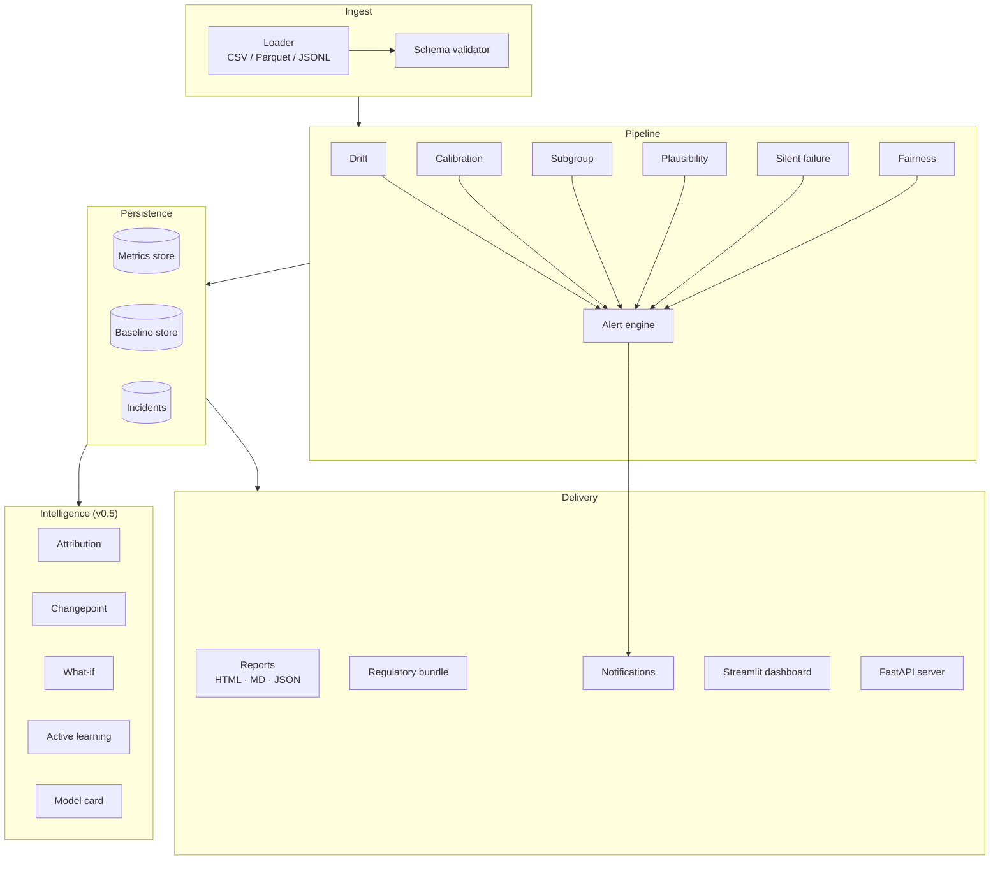
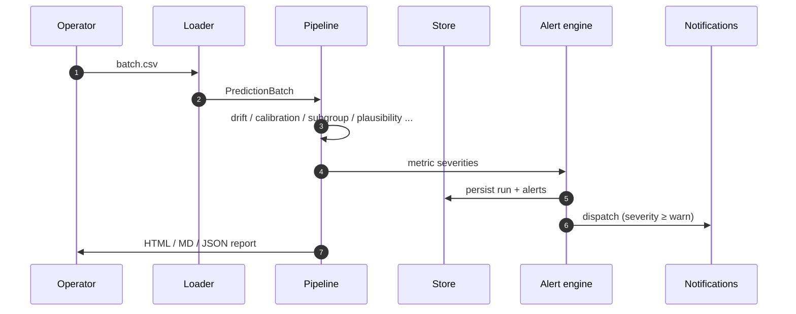

# Architecture

BioModel Monitor is a layered system. Each layer has one job and a stable
contract with the next; you can swap any layer (e.g. Postgres for SQLite, a
new notification channel, a new metric) without touching the rest.

## Layers

### 1. Schema (`biomodel_monitor/schema/`)
Pydantic v2 models for `PredictionRecord`, `BatchMetadata`, `PredictionBatch`,
plus a small declarative contract format for required fields and registered
sites.

### 2. Ingest (`ingest/`)
Loaders for CSV, Parquet, and JSONL. The loader is the only place that touches
your raw data.

### 3. Metrics (`metrics/`)
Each metric returns a dataclass with `.severity ∈ {ok, warn, alert}` and
`.as_dict()`. This is the single contract everything downstream consumes.
Implementations are pure-Python (numpy/pandas only) so they're easy to audit.

### 4. Baselines (`baselines/`)
Reference distributions for drift and calibration comparisons. The
`RollingBaselineLearner` folds new batches into a candidate baseline; an
operator explicitly **promotes** a candidate to live.

### 5. Alerts (`alerts/`)
Turns metric severities into deduplicated, persistence-aware alerts. The
`threshold_tuner` proposes new per-category thresholds from labeled history.

### 6. Store (`store/`)
A `Storage` Protocol with two concrete adapters:

- `MetricsStore` — SQLite (default, zero-ops).
- `PostgresStore` — production backend (via `psycopg`).

Persists batches, runs, alerts, metrics, baselines, annotations.

### 7. Incidents (`incidents/`)
Workspace for ack / resolve / comment / label on alerts. Annotations feed
threshold tuning and active-learning ranking.

### 8. Notifications (`notifications/`)
Pluggable channels: file, webhook (signed), Slack, PagerDuty, Microsoft Teams.
All built on a common `WebhookChannel` base with HMAC-SHA256 signing and
exponential-backoff retry.

### 9. Reports (`reports/`)
Jinja2 HTML + Markdown templates plus the regulatory export packer (signed
manifest with SHA-256 hashes).

### 10. Server (`server/`) &nbsp;<small>v0.4</small>
FastAPI app exposing the store and pipeline over REST, with API-key auth,
structured JSON access logs, and a Prometheus `/metrics` endpoint.

### 11. Intelligence (`intelligence/`) &nbsp;<small>v0.5</small>
- **`attribution`** — for any alert, rank which dimension/value contributed most.
- **`changepoint`** — divisive segmentation on metric history; pinpoints **when** drift began.
- **`whatif`** — recompute drift after counterfactually excluding a cohort/site/scanner.
- **`anomaly`** — robust z-score (MAD) layered onto every metric.
- **`active_learning`** — rank open incidents by expected information gain.
- **`modelcard`** — auto-generate a Markdown model card from the store.

### 12. Dashboard (`dashboard/`)
Streamlit app for triage; reads the same store the server writes to.

## Data flow for a single batch

