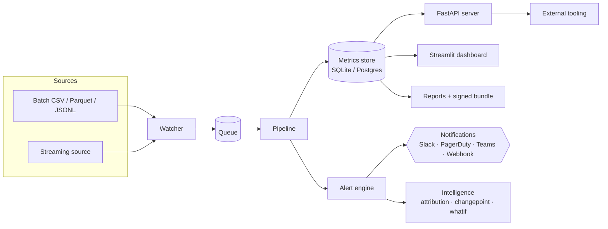

# BioModel Monitor

> **Post-deployment monitoring and assurance for multimodal medical AI.**

Generic ML monitoring tracks uptime and aggregate accuracy. **Medical AI fails differently** —
models can appear stable while becoming biologically implausible, clinically miscalibrated,
or distributionally brittle across sites, scanners, protocols, and populations.

BioModel Monitor is a specialized monitoring layer that speaks the language of biomedical
model risk: drift you can attribute to a scanner, calibration you can break down by cohort,
plausibility rules grounded in pathology / radiology / omics, and an audit trail you can
hand to a regulator.

-   :material-flask: __Domain-aware metrics__

    Drift, calibration, fairness, plausibility, and silent-failure detectors
    designed for pathology, radiology, and multimodal omics.

-   :material-server-network: __Service, not a script__ &nbsp;<small>v0.4</small>

    FastAPI server, Prometheus metrics, signed webhooks, Slack / PagerDuty / Teams,
    SQLite **or** Postgres, Docker Compose.

-   :material-brain: __Explains itself__ &nbsp;<small>v0.5</small>

    Per-alert root-cause attribution, changepoint detection, counterfactual
    "what-if" drift, active-learning incident queue, auto model cards.

-   :material-shield-check: __Audit-ready__

    Signed regulatory export bundles, persistent annotations, alert dedup with
    persistence-aware severity.

## What it answers

> *Is my model still behaving acceptably, and if not, exactly **where** is it breaking,
> **why**, and **what** would fix it?*

## Architecture at a glance

## Get started

[Quickstart :material-arrow-right:](quickstart.md){ .md-button .md-button--primary }
[Architecture :material-arrow-right:](architecture.md){ .md-button }
[Metric library :material-arrow-right:](metric_library.md){ .md-button }
