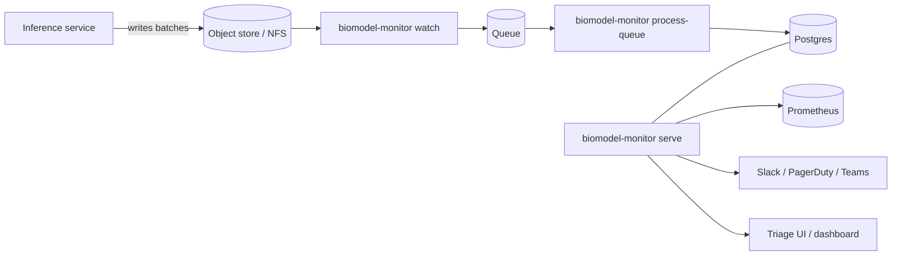

# Operating in production

## Reference deployment



## Process model

| Process            | What it does                                                |
| ------------------ | ----------------------------------------------------------- |
| `serve`            | HTTP API, OpenAPI, `/metrics`, model-card / whatif / explain |
| `watch`            | Tails an inbox directory, enqueues new batches              |
| `process-queue`    | Drains the queue, runs the pipeline, persists, alerts       |
| `dashboard`        | Streamlit triage UI                                         |

You can run them as separate containers (see `docker-compose.yml`) or as
systemd units. Each is restartable independently; state lives in the store.

## Postgres

```bash
pip install ".[postgres]"
export BIOMODEL_STORE_DSN=postgresql://user:pass@db/biomodel
biomodel-monitor serve
```

The `Storage` Protocol means every metric, alert, run, and annotation is
persisted in Postgres exactly like it is in SQLite — but with concurrent
writers, replication, and managed backups.

## Observability

- **Logs**: structured JSON on stdout. Fields: `ts`, `level`, `msg`, plus
  contextual keys (`method`, `path`, `status`, `duration_ms`, ...).
- **Metrics**: Prometheus at `/metrics` (no extra dependency).
- **Health**: `/health` returns 200 + version.

## Security

- API-key auth on every mutating endpoint.
- Webhooks signed with HMAC-SHA256 (`X-BioModel-Signature: v1=...`).
- Audit trail: every annotation includes actor + timestamp; the regulatory
  bundle hashes every artifact in a SHA-256 manifest.
- Container runs as non-root user (`uid 10001`).

See [Security & privacy checklist](security_privacy_checklist.md).

## Backups

- SQLite: snapshot the `*.db` file (the WAL is checkpointed on close).
- Postgres: managed backups + WAL archiving. Treat the metrics DB as a
  first-class operational database.
