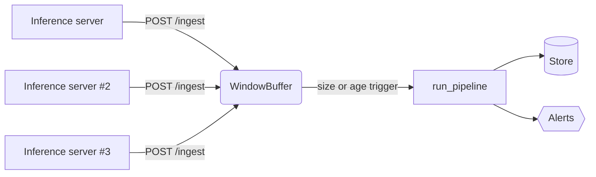

# Streaming ingestion (v0.6)

A real medical-AI deployment doesn't always produce a clean daily CSV. The
inference server emits one prediction at a time. v0.6 adds a server-side
**micro-batching window** so the monitor can be driven directly from the
inference path without rewriting your pipelines.

## How it works



Records are grouped by `(model_id, model_version)`. Each key has its own
window. A window is **flushed** when:

| Trigger | Configuration | Default |
| ------- | ------------- | ------- |
| **Size** — window has reached *N* records | `stream_max_records` / `BIOMODEL_STREAM_MAX_RECORDS` | `256` |
| **Age** — oldest record exceeds *T* seconds | `stream_max_age_s` / `BIOMODEL_STREAM_MAX_AGE_S` | `30.0` |
| **Manual** — caller passes `flush=true` on `/ingest` | per-request | off |

## Pushing records

```bash
curl -X POST https://monitor.example.com/ingest \
  -H "X-API-Key: $KEY" -H "Content-Type: application/json" \
  -d '{
    "model_id": "pathology-tumor-clf",
    "model_version": "1.0.0",
    "records": [
      {"prediction_id": "p1", "model_id": "pathology-tumor-clf",
       "model_version": "1.0.0", "timestamp": "2026-04-01T12:00:00Z",
       "site_id": "site-A", "prediction": 1, "score": 0.87}
    ]
  }'
```

Response shape:

```json
{
  "accepted": 1,
  "buffered": 1,
  "flushed_batches": 0,
  "flushed_records": 0,
  "runs_triggered": []
}
```

When the size threshold is crossed (or you pass `"flush": true`) the
response includes the `run_id`s the pipeline produced.

## CLI

End-of-day push from a JSONL file:

```bash
biomodel-monitor ingest \
  --server https://monitor.example.com --api-key $KEY \
  --model-id pathology-tumor-clf --model-version 1.0.0 \
  --input today.jsonl --flush
```

## Operational notes

- The buffer is **in-memory only** by design — at high QPS persisting every
  record per ingest call would dominate the latency budget. Windows live as
  long as the server process; on shutdown, hit `/ingest?flush=true` or
  `flush_all()` from a sidecar.
- The buffer is thread-safe and lock-protected.
- Flush is fully synchronous: `/ingest` returns *after* the pipeline has
  run on any flushed batch, so the response carries the resulting `run_id`s
  and the Prometheus alert counter is incremented.
